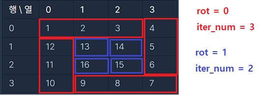
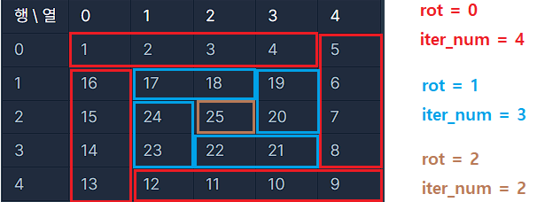

## 문제 정보

- 플랫폼 : 프로그래머스
- 문제 : https://school.programmers.co.kr/learn/courses/30/lessons/181832
- 난이도 : Lv.0
- 사용 언어 : python

## 접근 방식

- 총 1번의 회전(4번의 방향전환)이 이루어질 때, `rot(rotation)`의 값이 증가하도록 구상

- `range(rot, iter_num)` 의 반복문을 이용하여 한 번에 선택되는 숫자의 개수를 계산. e.g : n이 5일때, 처음 rotation은 `range(0,4)`로 `0,1,2,3`의 4개 선택

- 1번의 회전이 이루어질 경우, `rot` 은 1 증가하고, `iter_num`은 1이 감소하도록 하여, 한 번 rotation이 될 때마다 한 번에 선택되는 숫자는 -2 만큼 감소

- `rot` 값을 이용하여 4방향 (right, down, left, up)의 각각의 경우에 대하여 해당 배열에 값을 채움

- n이 홀수일 경우, 가운데에 1개의 값 추가

</img>
</img>
